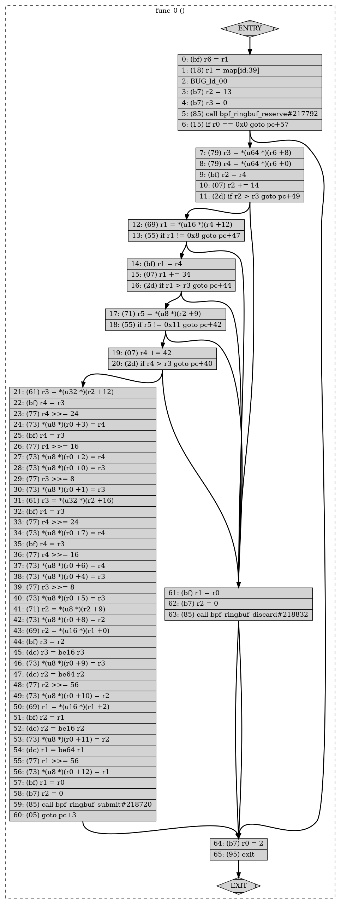

# bpf-xdp-go-template

A GitHub template repository with the scaffolding for a XDP program developed with [libbpf/libbpf].
The loader is written in Go and is using the [cilium/ebpf] library to manage BPF objects, i.e. load BPF programs,
access BPF maps, etc.

## Usage

Create a new repository from this template by clicking the **Use this template** button in the GitHub interface.
Once it's done, clone and change current directory to the cloned repository:

```
$ git clone https://github.com/$owner/$repo.git
$ cd $repo
$ git submodule update --init --recursive
```

Compile BPF program and Go loader:

```
$ make
```

Run the loader program, which will attach the XDP program to the `eth0` interface.

``` console
# ./xdp --interface=eth0
Source          Destination             Protocol
172.16.184.2:53 172.16.184.134:44240    UDP
172.16.184.2:53 172.16.184.134:44240    UDP
172.16.184.2:53 172.16.184.134:40356    UDP
172.16.184.2:53 172.16.184.134:40356    UDP
172.16.184.2:53 172.16.184.134:52815    UDP
_
```

If everything is fine, you can start modifying the scaffolding to adjust the XDP program to your needs.
To verify that the `xdp_prog_func` XDP program was attached to the `eth0` interface inspect the output
of the `ip address show` command:

``` console
$ ip a show dev eth0
2: eth0: <BROADCAST,MULTICAST,UP,LOWER_UP> mtu 1500 xdpgeneric/id:21 qdisc fq_codel state UP group default qlen 1000
    link/ether 00:0c:29:e1:bb:04 brd ff:ff:ff:ff:ff:ff
    inet 192.168.10.130/24 brd 192.168.10.255 scope global dynamic noprefixroute eth0
       valid_lft 1417sec preferred_lft 1417sec
    inet6 fe80::20c:29ff:fee1:bb04/64 scope link noprefixroute
       valid_lft forever preferred_lft forever
```

Notice that there is the `xdpgeneric/id:21` entry, which indicates that the program was indeed attached,
and its id is `21`. XDP has three operation modes (native, offloaded, and generic) to accommodate easily
testing functions, custom hardware from vendors, and commonly built kernels without custom hardware.
The `xdpgeneric/id:21` entry indicates the generic operation mode, which is provided as a test-mode
for developers who want to write and run XDP programs without having the capabilities of native or offloaded XDP.

When you hit CTRL+C keys to stop the loader process, the XDP program will be detached from the `eth0` interface.


## Using Alternative Loaders

### Docker

```
$ make image
```
```
$ docker run -it --rm --privileged --network=host --pid=host \
    danielpacak/bpf-xdp-go-template --interface=eth0
```

### Iproute2

The `ip` command, available in [iproute2], has the ability to act as a frontend to load XDP programs compiled
into an ELF file. Because loading an XDP program can be expressed as a configuration of a network interface,
the loader is implemented as part of the `ip link` command (man 8 ip-link), which is the one that does network
device configuration.

The syntax to load the XDP program is simple.

```
# ip link set dev eth0 xdp obj src/xdp.bpf.o program xdp_prog_func verbose
```

To detach the `xdp_prog_func` program and turn off XDP for the device.

```
# ip link set dev eth0 xdp off
```

### bpftool

Use bpftool to load and attach XDP programs.

```
# bpftool prog load src/xdp.bpf.o /sys/fs/bpf/xdp_prog_func
```

You can further inspect the program with the `btftool` command.

``` console
# bpftool prog show id 21
21: xdp  name xdp_prog_func  tag 50fcfa8b9d387625  gpl
        loaded_at 2023-03-03T10:10:37+0100  uid 0
        xlated 208B  jited 123B  memlock 4096B  map_ids 3
        btf_id 147
```

```
# bpftool net attach xdp id 21 dev eth0
```

``` console
# bpftool net list
xdp:
eth0(2) generic id 21

tc:

flow_dissector:
```

```
# bpftool net detach xdp dev eth0
```
```
# rm /sys/fs/bpf/xdp_prog_func
```

## Inspecting BPF Bytecode

The `file` utility shows that `xdp.bpf.o` is an ELF (Executable and Linkable Format) file, containing eBPF
code, for a 64-bit platform with LSB (lowest significant bit) architecture.

``` console
$ file src/xdp.bpf.o
src/xdp.bpf.o: ELF 64-bit LSB relocatable, eBPF, version 1 (SYSV), not stripped
```

You can further inspect this object with `llvm-objdump` to see the eBPF instructions.

``` console
$ llvm-objdump -d src/xdp.bpf.o

src/xdp.bpf.o:	file format elf64-bpf

Disassembly of section xdp:

0000000000000000 <xdp_prog_func>:
       0:	bf 16 00 00 00 00 00 00	r6 = r1
       1:	18 01 00 00 00 00 00 00 00 00 00 00 00 00 00 00	r1 = 0 ll
       3:	b7 02 00 00 0d 00 00 00	r2 = 13
       4:	b7 03 00 00 00 00 00 00	r3 = 0
       5:	85 00 00 00 83 00 00 00	call 131
       6:	15 00 39 00 00 00 00 00	if r0 == 0 goto +57 <LBB0_8>
       7:	61 63 04 00 00 00 00 00	r3 = *(u32 *)(r6 + 4)
       8:	61 64 00 00 00 00 00 00	r4 = *(u32 *)(r6 + 0)
       9:	bf 42 00 00 00 00 00 00	r2 = r4
      10:	07 02 00 00 0e 00 00 00	r2 += 14
      11:	2d 32 31 00 00 00 00 00	if r2 > r3 goto +49 <LBB0_7>
      12:	69 41 0c 00 00 00 00 00	r1 = *(u16 *)(r4 + 12)
      13:	55 01 2f 00 08 00 00 00	if r1 != 8 goto +47 <LBB0_7>
      14:	bf 41 00 00 00 00 00 00	r1 = r4
      15:	07 01 00 00 22 00 00 00	r1 += 34
      16:	2d 31 2c 00 00 00 00 00	if r1 > r3 goto +44 <LBB0_7>
      17:	71 25 09 00 00 00 00 00	r5 = *(u8 *)(r2 + 9)
      18:	55 05 2a 00 11 00 00 00	if r5 != 17 goto +42 <LBB0_7>
      19:	07 04 00 00 2a 00 00 00	r4 += 42
      20:	2d 34 28 00 00 00 00 00	if r4 > r3 goto +40 <LBB0_7>
      21:	61 23 0c 00 00 00 00 00	r3 = *(u32 *)(r2 + 12)
      22:	bf 34 00 00 00 00 00 00	r4 = r3
      23:	77 04 00 00 18 00 00 00	r4 >>= 24
      24:	73 40 03 00 00 00 00 00	*(u8 *)(r0 + 3) = r4
      25:	bf 34 00 00 00 00 00 00	r4 = r3
      26:	77 04 00 00 10 00 00 00	r4 >>= 16
      27:	73 40 02 00 00 00 00 00	*(u8 *)(r0 + 2) = r4
      28:	73 30 00 00 00 00 00 00	*(u8 *)(r0 + 0) = r3
      29:	77 03 00 00 08 00 00 00	r3 >>= 8
      30:	73 30 01 00 00 00 00 00	*(u8 *)(r0 + 1) = r3
      31:	61 23 10 00 00 00 00 00	r3 = *(u32 *)(r2 + 16)
      32:	bf 34 00 00 00 00 00 00	r4 = r3
      33:	77 04 00 00 18 00 00 00	r4 >>= 24
      34:	73 40 07 00 00 00 00 00	*(u8 *)(r0 + 7) = r4
      35:	bf 34 00 00 00 00 00 00	r4 = r3
      36:	77 04 00 00 10 00 00 00	r4 >>= 16
      37:	73 40 06 00 00 00 00 00	*(u8 *)(r0 + 6) = r4
      38:	73 30 04 00 00 00 00 00	*(u8 *)(r0 + 4) = r3
      39:	77 03 00 00 08 00 00 00	r3 >>= 8
      40:	73 30 05 00 00 00 00 00	*(u8 *)(r0 + 5) = r3
      41:	71 22 09 00 00 00 00 00	r2 = *(u8 *)(r2 + 9)
      42:	73 20 08 00 00 00 00 00	*(u8 *)(r0 + 8) = r2
      43:	69 12 00 00 00 00 00 00	r2 = *(u16 *)(r1 + 0)
      44:	bf 23 00 00 00 00 00 00	r3 = r2
      45:	dc 03 00 00 10 00 00 00	r3 = be16 r3
      46:	73 30 09 00 00 00 00 00	*(u8 *)(r0 + 9) = r3
      47:	dc 02 00 00 40 00 00 00	r2 = be64 r2
      48:	77 02 00 00 38 00 00 00	r2 >>= 56
      49:	73 20 0a 00 00 00 00 00	*(u8 *)(r0 + 10) = r2
      50:	69 11 02 00 00 00 00 00	r1 = *(u16 *)(r1 + 2)
      51:	bf 12 00 00 00 00 00 00	r2 = r1
      52:	dc 02 00 00 10 00 00 00	r2 = be16 r2
      53:	73 20 0b 00 00 00 00 00	*(u8 *)(r0 + 11) = r2
      54:	dc 01 00 00 40 00 00 00	r1 = be64 r1
      55:	77 01 00 00 38 00 00 00	r1 >>= 56
      56:	73 10 0c 00 00 00 00 00	*(u8 *)(r0 + 12) = r1
      57:	bf 01 00 00 00 00 00 00	r1 = r0
      58:	b7 02 00 00 00 00 00 00	r2 = 0
      59:	85 00 00 00 84 00 00 00	call 132
      60:	05 00 03 00 00 00 00 00	goto +3 <LBB0_8>

00000000000001e8 <LBB0_7>:
      61:	bf 01 00 00 00 00 00 00	r1 = r0
      62:	b7 02 00 00 00 00 00 00	r2 = 0
      63:	85 00 00 00 85 00 00 00	call 133

0000000000000200 <LBB0_8>:
      64:	b7 00 00 00 02 00 00 00	r0 = 2
      65:	95 00 00 00 00 00 00 00	exit
```

``` console
# bpftool prog dump xlated name xdp_prog_func linum
int xdp_prog_func(struct xdp_md * ctx):
; int xdp_prog_func(struct xdp_md *ctx) { [file:./src/xdp.bpf.c line_num:19 line_col:0]
   0: (bf) r6 = r1
; event = (struct event *)bpf_ringbuf_reserve(&events, sizeof(struct event), 0); [file:./src/xdp.bpf.c line_num:22 line_col:27]
   1: (18) r1 = map[id:39]
   3: (b7) r2 = 13
   4: (b7) r3 = 0
   5: (85) call bpf_ringbuf_reserve#217792
; if (event == NULL) { [file:./src/xdp.bpf.c line_num:23 line_col:7]
   6: (15) if r0 == 0x0 goto pc+57
; void *data_end = (void *)(long)ctx->data_end; [file:./src/xdp.bpf.c line_num:40 line_col:39]
   7: (79) r3 = *(u64 *)(r6 +8)
; void *data = (void *)(long)ctx->data; [file:./src/xdp.bpf.c line_num:39 line_col:35]
   8: (79) r4 = *(u64 *)(r6 +0)
; if (data + sizeof(struct ethhdr) > data_end) { [file:./src/xdp.bpf.c line_num:43 line_col:12]
   9: (bf) r2 = r4
  10: (07) r2 += 14
; if (data + sizeof(struct ethhdr) > data_end) { [file:./src/xdp.bpf.c line_num:43 line_col:7]
  11: (2d) if r2 > r3 goto pc+49
; if (eth->h_proto != bpf_htons(ETH_P_IP)) { [file:./src/xdp.bpf.c line_num:48 line_col:12]
  12: (69) r1 = *(u16 *)(r4 +12)
; if (eth->h_proto != bpf_htons(ETH_P_IP)) { [file:./src/xdp.bpf.c line_num:48 line_col:7]
  13: (55) if r1 != 0x8 goto pc+47
; if (data + sizeof(struct iphdr) > data_end) { [file:./src/xdp.bpf.c line_num:53 line_col:12]
  14: (bf) r1 = r4
  15: (07) r1 += 34
; if (data + sizeof(struct iphdr) > data_end) { [file:./src/xdp.bpf.c line_num:53 line_col:7]
  16: (2d) if r1 > r3 goto pc+44
; if (ip->protocol != IPPROTO_UDP) { [file:./src/xdp.bpf.c line_num:58 line_col:11]
  17: (71) r5 = *(u8 *)(r2 +9)
; if (ip->protocol != IPPROTO_UDP) { [file:./src/xdp.bpf.c line_num:58 line_col:7]
  18: (55) if r5 != 0x11 goto pc+42
  19: (07) r4 += 42
  20: (2d) if r4 > r3 goto pc+40
; e->ip_src = ip->saddr; [file:./src/xdp.bpf.c line_num:68 line_col:19]
  21: (61) r3 = *(u32 *)(r2 +12)
; e->ip_src = ip->saddr; [file:./src/xdp.bpf.c line_num:68 line_col:13]
  22: (bf) r4 = r3
  23: (77) r4 >>= 24
  24: (73) *(u8 *)(r0 +3) = r4
  25: (bf) r4 = r3
  26: (77) r4 >>= 16
  27: (73) *(u8 *)(r0 +2) = r4
  28: (73) *(u8 *)(r0 +0) = r3
  29: (77) r3 >>= 8
  30: (73) *(u8 *)(r0 +1) = r3
; e->ip_dst = ip->daddr; [file:./src/xdp.bpf.c line_num:69 line_col:19]
  31: (61) r3 = *(u32 *)(r2 +16)
; e->ip_dst = ip->daddr; [file:./src/xdp.bpf.c line_num:69 line_col:13]
  32: (bf) r4 = r3
  33: (77) r4 >>= 24
  34: (73) *(u8 *)(r0 +7) = r4
  35: (bf) r4 = r3
  36: (77) r4 >>= 16
  37: (73) *(u8 *)(r0 +6) = r4
  38: (73) *(u8 *)(r0 +4) = r3
  39: (77) r3 >>= 8
  40: (73) *(u8 *)(r0 +5) = r3
; e->ip_protocol = ip->protocol; [file:./src/xdp.bpf.c line_num:70 line_col:24]
  41: (71) r2 = *(u8 *)(r2 +9)
; e->ip_protocol = ip->protocol; [file:./src/xdp.bpf.c line_num:70 line_col:18]
  42: (73) *(u8 *)(r0 +8) = r2
; e->udp_src = bpf_ntohs(udp->source); [file:./src/xdp.bpf.c line_num:71 line_col:16]
  43: (69) r2 = *(u16 *)(r1 +0)
  44: (bf) r3 = r2
  45: (dc) r3 = be16 r3
; e->udp_src = bpf_ntohs(udp->source); [file:./src/xdp.bpf.c line_num:71 line_col:14]
  46: (73) *(u8 *)(r0 +9) = r3
; e->udp_src = bpf_ntohs(udp->source); [file:./src/xdp.bpf.c line_num:71 line_col:16]
  47: (dc) r2 = be64 r2
; e->udp_src = bpf_ntohs(udp->source); [file:./src/xdp.bpf.c line_num:71 line_col:14]
  48: (77) r2 >>= 56
  49: (73) *(u8 *)(r0 +10) = r2
; e->udp_dst = bpf_ntohs(udp->dest); [file:./src/xdp.bpf.c line_num:72 line_col:16]
  50: (69) r1 = *(u16 *)(r1 +2)
  51: (bf) r2 = r1
  52: (dc) r2 = be16 r2
; e->udp_dst = bpf_ntohs(udp->dest); [file:./src/xdp.bpf.c line_num:72 line_col:14]
  53: (73) *(u8 *)(r0 +11) = r2
; e->udp_dst = bpf_ntohs(udp->dest); [file:./src/xdp.bpf.c line_num:72 line_col:16]
  54: (dc) r1 = be64 r1
; e->udp_dst = bpf_ntohs(udp->dest); [file:./src/xdp.bpf.c line_num:72 line_col:14]
  55: (77) r1 >>= 56
  56: (73) *(u8 *)(r0 +12) = r1
; bpf_ringbuf_submit(event, 0); [file:./src/xdp.bpf.c line_num:32 line_col:3]
  57: (bf) r1 = r0
  58: (b7) r2 = 0
  59: (85) call bpf_ringbuf_submit#218720
  60: (05) goto pc+3
; bpf_ringbuf_discard(event, 0); [file:./src/xdp.bpf.c line_num:28 line_col:5]
  61: (bf) r1 = r0
  62: (b7) r2 = 0
  63: (85) call bpf_ringbuf_discard#218832
; return XDP_PASS; [file:./src/xdp.bpf.c line_num:35 line_col:3]
  64: (b7) r0 = 2
  65: (95) exit
```

``` console
# bpftool prog dump xlated name xdp_prog_func visual > out.dot
```
```
$ dot -Tpng out.dot > out.png
```



[libbpf/libbpf]: https://github.com/libbpf/libbpf
[libbpf/libbpf-bootstrap]: https://github.com/libbpf/libbpf-bootstrap
[cilium/ebpf]: https://github.com/cilium/ebpf
[iproute2]: https://wiki.linuxfoundation.org/networking/iproute2
